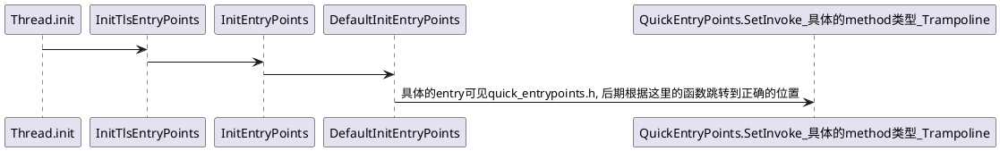
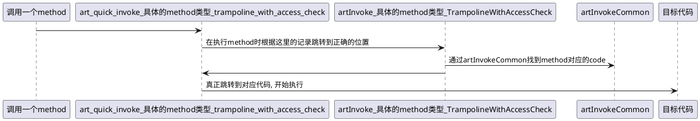
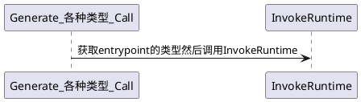
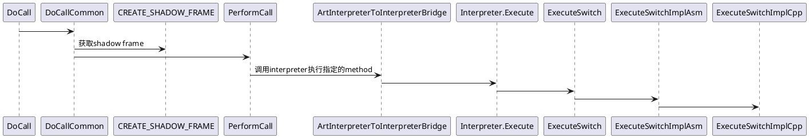
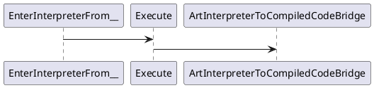
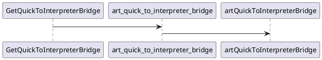

# ART(Android Runtime)

ART(Android Runtime)是多个模块的集合, 其包括:

* dex2oat: 编译器, 负责AOT(Ahead-of-Time, 一般是指在应用安装时)编译应用代码(dex)为native代码(oat, 本质是一种elf).
* libart.so: core runtime environment, 负责在程序运行时加载并运行代码.
* libcore: managed core library, 提供必要的Java API实现(实现Java和Kotlin的标准库).
* libnativehelper: JNI helper library, 为Java/Kotlin与native的交互提供工具.
* libnativeloader: native library loader, 在运行时定位并加载共享库.

* JIT compiler: 运行时编译器, 负责在程序运行时将性能热点编译为native, 这部分是在libart.so中.
* garbage collector: 管理应用使用的内存, 回收内存, 避免内存泄漏, 这部分是在libart.so中.

‍

## ART的运行

Android应用在安装时, 系统会调用dex2oat将apk中的dex(Dalvik Executable)文件(包含了应用的bytecode, 为Java/Kotlin编译为的中间形式)编译为机器码, 这个过程被称为AOT(Ahead-of-Time) compilation. 编译产物以ELF格式存放在oat文件中, 包含了dex文件对应的机器码. 在新的Android版本中, 还会生成额外的vdex文件和art文件. vdex文件包含了能够加速DEX代码验证的metadata(存放原始的DEX文件). art文件包含一些预初始化的数据结构, 让ART能够加速应用启动.

ART是AOT-compilation, JIT-compilation, interpretation结合的复杂系统. 这三者存在的目的是适应性的性能优化, ART会根据应用性能情况与设备状态动态选择合适的运行方式.

当我们启动应用时, ART runtime(libart.so)进行初始化并加载预编译的代码(上文中的OAT文件). 在运行时, ART runtime会以interpretation的方式运行bytecode, 根据使用频率将部分热点代码编译为native代码, 这个过程被称为JIT(Just-in-Time) compilation.

### AOT

AOT compilation主要通过dex2oat来实现. dex2oat一般被存放在/system/bin文件夹,编译出的OAT文件通常存放在/data/dalvik-cache/<architecture>中 dex2oat的行为可以被各种编译器选项控制, 如:

* speed: 尝试编译所有method
* speed-profile: 编译在profile中指定的method
* verify: 执行dex验证而非编译

OAT文件以ELF格式组织, 系统使用/system/bin/linker(64)来load这些文件(就像我们在linux上用`/usr/lib64/ld-linux-x86-64.so.2`​来启动程序). 在OAT文件中, 指定的symbol提供运行时的entry points. 

ART根据开发者提供的Baseline Profiles(如apk中的assets/dexopt/baseline.prof)来在安装apk时进行AOT compilation. 这能够让应用的性能(尤其是冷启动)大幅提升.

‍

### JIT

JIT通常用在没有完全AOT-compiled的应用, 通常以两种方式决定需要编译的method:

* ART利用"hotness"计数器对每个method计数, 当这个数超过一个预定值(`dalvik.vm.jitthreshold`​, 默认为10000, 当然ART对这个counter还有其他的加权, 如`dalvik.vm.jitprithreadweight`​对应不同线程的优先级和`dalvik.vm.jittransitionweight`​对应transition发生的频率), 那么对应的method成为JIT编译的候选.

* Profiling是JIT编译的基础, 其标记应用最常执行和最影响性能的segments. profiling信息还对后续的PGO(Profile-Guided Optimization)策略产生影响. profiling数据后续还被dex2oat使用, 在设备空闲并充电时, 再次对性能热点进行AOT编译.

主要优化方法:

JIT与AOT公用许多类似的优化方法, 但由于JIT编译发生在运行时, 所以其能有更多运行时类型信息, 可以做出更激进的优化, 包括:

* Inline: 就是普通的inline, 不必多说
* OSR(On-Stack Replacement): OSR能够让一个正在(以interpretation或优化程度较低的方式)运行的method无感的切换到一个新的JIT-compiled版本.
* Loop Optimizations: 包含优化掉循环的数据越界检查, loop counter, loop中的dead code, vectorization, SIMD等.
* Devirtualization: ART利用CHA(Class Hierarchy Analysis)来将virtual method调用转换为直接调用(如果能在编译期决定).
* Misc: 常数计算, 多态cache等一些常用的编译优化.

JIT compiled的代码被存放在内存的特定区域, 被成为JIT code cache. 这块cache有初始(`dalvik.vm.jitinitialsize`​)和最大(`dalvik.vm.jitmaxsize`​)大小, 且在系统的内存压力大时会被回收.

‍

### AOT & JIT & Interpreter

ART动态的管理不同类型methods的运行, 在AOT-compiled, JIT-compiled和interpreted DEX bytecode之间切换, 其对于不同运行方式的选择一般遵从:

1. AOT-Compiled Code Preferred: 若method有已经经过AOT编译的版本, 选择AOT版本.
2. JIT-Compiled Code Over AOT: JIT版本与AOT版本(AOT版本优化程度较低)同时存在时, 选择JIT版本
3. Interpreter as Fallback or Initial Executor: 无AOT版本时, ART使用interpreter来执行method
4. JIT Compilation from Interpreted Code: 被Interpreter频繁调用的method被编译为JIT版本.

AOT与JIT都在运行native代码, 而Interpreater是在解释bytecode, 这两者之间的转换被称为"transition", 由runtime完成.

ART的编译(包括AOT和JIT)逻辑并不是一个单次的过程, 而是一个复杂的循环. 最开始(第一次运行)的执行会根据Baseline Profiles决定编译目标. 在后续的执行中会动态的编译JIT版本, 在设备空闲时重新编译AOT版本method, 即便AOT版本的method存在, JIT版本仍旧有可能重新编译. ART的编译是一个execution->profiling->recompilation的过程. 而在native代码运行过程中可能会发生错误, 在运行时检测出这些错误并回退到bytecode版本的过程叫做"deoptimization". 这种对JIT, AOT, Interpreter的动态选择的运行方式正是ART的基础.

‍

|Feature|Interpreter|JIT Compilation|AOT Compilation|
| ----------------------| -----------------------------------------------| --------------------------------------------------| ------------------------------------------------------------------------|
|Primary Mechanism|Bytecode execution|Dynamic native code compilation at runtime|Static native code compilation (install/idle time)|
|Compilation Trigger|On-demand/fallback for uncompiled code|Hotness counters, runtime profiling|Install-time, idle-time, profile-guided (Baseline/Cloud)|
|Code Output|None (direct execution)|Native code in JIT code cache (in-memory)|Native code in OAT files (on-disk)|
|Performance Overhead|High per instruction|Initial compilation cost, memory for cache|Installation time, storage space for OAT files|
|Optimization Scope|None|Runtime-specific, On-Stack Replacement (OSR)|Global (whole method), profile-based, inter-procedural (potentially)|
|Key Advantage|Fast startup for unprofiled/non-critical code|Adaptive optimization based on current execution|Best peak performance for frequently executed/profiled code|
|Key Disadvantage|Slowest execution speed|Runtime compilation overhead, code cache memory|Longer install times, larger storage, less adaptive to dynamic changes|

#### **Transitions Between Native and Bytecode**

ART doesn't have a single "Program Counter" that magically switches between native and bytecode in the way a CPU PC switches between native instructions. Instead, the transition is managed through the `ArtMethod`​ entry points and ART's internal dispatch mechanisms:

* **Starting with AOT/JIT Code:**

  * When a method is called, ART looks up its `ArtMethod`​.
  * If a valid native compiled code entry point exists (from AOT or JIT), ART transfers control directly to that native code address. The CPU's Program Counter now executes these native instructions.
* **Transitioning from Native (AOT/JIT) to Interpreted Bytecode:**

  * This typically happens when an AOT/JIT compiled method calls another method that has *not* been compiled to native code (or was deoptimized).
  * The calling native code (generated by `dex2oat`​ or JIT) won't directly jump to bytecode. Instead, it will likely call a runtime helper function or a specific "trampoline" within ART.
  * This ART helper function will:

    1. Look up the `ArtMethod`​ of the callee.
    2. Find that the primary entry point is for the interpreter.
    3. Set up the interpreter's state for the callee method. This involves:

        * Locating the callee's DEX bytecode (using the `dex_method_index`​ in its `ArtMethod`​ and the DEX file in the `oatdata`​ section or a separate `.vdex`​ file).
        * Preparing a new stack frame for the interpreted method.
        * Setting an "interpreter program counter" to the beginning of the callee's bytecode.
    4. Start the interpreter loop, which fetches, decodes, and executes bytecode instructions one by one. The CPU's PC is now running the interpreter's C++ code, while the interpreter itself manages the logical flow through the bytecode.
* **Transitioning from Interpreted Bytecode to Native (AOT/JIT) Code:**

  * When an interpreted method calls another method that *is* AOT/JIT compiled:

    1. The interpreter, upon encountering an invoke-style bytecode instruction, will resolve the target method.
    2. It looks up the callee's `ArtMethod`​.
    3. It finds the native compiled code entry point.
    4. The interpreter will then call a runtime function or use a specific trampoline to prepare for the transition to native code. This involves:

        * Setting up arguments for the native call according to the native calling convention.
        * Potentially saving any necessary interpreter state.
    5. ART then transfers control to the native entry point of the callee method. The CPU's PC now executes the callee's native instructions.
* **JIT Compilation Trigger and On-Stack Replacement (OSR):**

  * If a method is being interpreted and ART's profiler detects it's "hot" (frequently executed), it can trigger JIT compilation.
  * Once JIT compilation is complete, ART might perform **On-Stack Replacement (OSR)** .^^ If the "hot" method is currently active on the call stack (i.e., it's in the middle of execution via the interpreter), OSR allows ART to seamlessly switch execution from the interpreter to the newly JIT-compiled native code *for the current invocation* of that method, without waiting for it to return and be called again. This is a more advanced transition.

**4. The Role of the Call Stack:**

ART uses a unified call stack that can accommodate frames from both compiled native methods and interpreted methods.

* **Native Method Frames:**  These look like standard native C/C++ stack frames, containing saved registers, local variables, and the return address.
* **Interpreted Method Frames:**  These are managed by the interpreter. They will contain information like the current DEX "program counter", local variables/registers for the bytecode method, and a reference to the operand stack used by bytecode instructions.
* **Transitions:**  When transitioning between execution modes, ART ensures the stack is correctly set up for the next method, whether it's creating a native frame or an interpreter frame. Special "trampoline" functions or runtime stubs often manage this setup and teardown during calls.

‍

‍

### TODO: [https://docs.google.com/document/d/1qV10T5U69_3hFFmgqG4ibhVT5WklmY8lo02oylF439k/edit?tab=t.0](https://docs.google.com/document/d/1qV10T5U69_3hFFmgqG4ibhVT5WklmY8lo02oylF439k/edit?tab=t.0)

‍

‍

## ART运行状态

* AOT(Ahead-Of-Time)

  主要在应用安装时, 由`dex2oat`​将DEX编译生成native code.
* JIT(Just-In-Time)

  应用运行时, ART统计method运行频率, 根据状况将常用method编译为native code. 这些代码被存储在内存中(JIT code cache), 在应用关闭后就丢失了.

* Interpreter

  没有method对应的native code时, ART将运行Interpreter来执行dex.

ART使用这三种状态处理不同情况, 增加运行效率与兼容性.

‍

### 关于native code的跳转

ART在interpreter和native互相切换时需要借助"Bridge"

ART在native下使用"Trampoline"(理解为跳板?)来找到需要调用的native code

线程初始化时:



初始化时在Thread的`Tlsptr_.*entrypoints`​中注册了需要的Trampoline(使用`QUICK_ENTRYPOINT_OFFSET`​可以找到使用到entrypoints的地方).

可以看到在CodeGen的阶段使用到了`EntryPoints`​, 推测Trampoline函数的地址应该是被放到了生成的代码里面. 也就是说我们无法在生成代码之外的地方找到目标method(或许之后可以通过objdump oat文件来做一些事情?).

当我们在运行JAVA代码(dex)时, ART使用interpreter来执行代码, 当其需要跳转到native时, 其通过`Bridge()`​来切换到native环境, 然后按照下图:

进入native环境后:



‍

‍

​`ArtMethod.Invoke()`​对应的是Interpreter运行

​`artInvokeCommon()`​用于找到entry point

‍

### 方案

现在有几种方案:

1. 从interpreter进入quick code时会使用`ArtInterpreterToCompiledCodeBridge()`​(`art_quick_invoke_stub_internal`​)

    从quick code进入interpreter时会用`art_quick_to_interpreter_bridge`​(实际上是在调用`artQuickToInterpreterBridge()`​).

    从两个bridge记录应该是可以记录native的运行时间的. 但缺点是有时候ART不一定固定走这两个bridge, 也可能走deoptimize bridge之类的, 工作量会比较大, 调用栈可能不全.
2. 在trampoline里面加trace, 也就是在汇编里面写, 感觉要调一下, 不清楚用函数跳转可不可行.

3. 在CodeGen的阶段将trace插入生成代码, 这就需要具体来看看CodeGen的代码了, 可行性不高, 但是效果应该最好, 因为CodeGen阶段可以找到所有的调用的函数, 其他方法只能找到1层.

‍

在quick_entrypoints_arm64.S中`INVOKE_TRAMPOLINE_BODY`​来通过trampoline获取code地址并调用code:

```armasm
    /*
     * All generated callsites for interface invokes and invocation slow paths will load arguments
     * as usual - except instead of loading arg0/x0 with the target Method*, arg0/x0 will contain
     * the method_idx.  This wrapper will save arg1-arg3, and call the appropriate C helper.
     * NOTE: "this" is first visible argument of the target, and so can be found in arg1/x1.
     *
     * The helper will attempt to locate the target and return a 128-bit result in x0/x1 consisting
     * of the target Method* in x0 and method->code_ in x1.
     *
     * If unsuccessful, the helper will return null/????. There will be a pending exception in the
     * thread and we branch to another stub to deliver it.
     *
     * On success this wrapper will restore arguments and *jump* to the target, leaving the lr
     * pointing back to the original caller.
     *
     * Adapted from ARM32 code.
     *
     * Clobbers xIP0.
     */
.macro INVOKE_TRAMPOLINE_BODY cxx_name
    .extern \cxx_name
    SETUP_SAVE_REFS_AND_ARGS_FRAME        // save callee saves in case allocation triggers GC
    // Helper signature is always
    // (method_idx, *this_object, *caller_method, *self, sp)

    mov    x2, xSELF                      // pass Thread::Current
    mov    x3, sp
    bl     \cxx_name                      // (method_idx, this, Thread*, SP)
    mov    xIP0, x1                       // save Method*->code_
    RESTORE_SAVE_REFS_AND_ARGS_FRAME
    REFRESH_MARKING_REGISTER
    cbz    x0, 1f                         // did we find the target? if not go to exception delivery
    br     xIP0                           // tail call to target
1:
    DELIVER_PENDING_EXCEPTION
.endm
.macro INVOKE_TRAMPOLINE c_name, cxx_name
ENTRY \c_name
    INVOKE_TRAMPOLINE_BODY \cxx_name
END \c_name
.endm

INVOKE_TRAMPOLINE art_quick_invoke_interface_trampoline_with_access_check, \
                  artInvokeInterfaceTrampolineWithAccessCheck

INVOKE_TRAMPOLINE art_quick_invoke_static_trampoline_with_access_check, \
                  artInvokeStaticTrampolineWithAccessCheck
INVOKE_TRAMPOLINE art_quick_invoke_direct_trampoline_with_access_check, \
                  artInvokeDirectTrampolineWithAccessCheck
INVOKE_TRAMPOLINE art_quick_invoke_super_trampoline_with_access_check, \
                  artInvokeSuperTrampolineWithAccessCheck
INVOKE_TRAMPOLINE art_quick_invoke_virtual_trampoline_with_access_check, \
                  artInvokeVirtualTrampolineWithAccessCheck
```

上述代码中提到的形如`art_quick_invoke_super_trampoline_with_access_check`​的函数就是`qpoints`​设置的对应method的trampoline, 与`artInvokeSuperTrampolineWithAccessCheck()`​等价.

在运行时通过`artInvokeSuperTrampolineWithAccessCheck()`​找到对应的code.

而

```armasm
    br     xIP0                           // tail call to target
```

跳转到这段code.

目前只清楚`qpoint`​在线程初始化的时候使用到了这些trampoline, 具体的对trampoline的访问可能在codegen中



‍

### Interpreter

每个ART中的**​`Thread*`​** ​都包含一个`ShadowFrame`​, 用于表示此线程(这里指interpreting dex的虚拟机)的栈和寄存器, 在调用method时会创建新的`ShadowFrame`​.

下图为调用一个method的流程



‍

```armasm
// Wrap ExecuteSwitchImpl in assembly method which specifies DEX PC for unwinding.
//  Argument 0: x0: The context pointer for ExecuteSwitchImpl.
//  Argument 1: x1: Pointer to the templated ExecuteSwitchImpl to call.
//  Argument 2: x2: The value of DEX PC (memory address of the methods bytecode).
ENTRY ExecuteSwitchImplAsm
    SAVE_TWO_REGS_INCREASE_FRAME x19, xLR, 16
    mov x19, x2                                   // x19 = DEX PC
    CFI_DEFINE_DEX_PC_WITH_OFFSET(0 /* x0 */, 19 /* x19 */, 0)
    blr x1                                        // Call the wrapped method.
    RESTORE_TWO_REGS_DECREASE_FRAME x19, xLR, 16
    ret
END ExecuteSwitchImplAsm
```

这里实际上是跳到了`ExecuteSwitchImplCpp()`​.

除了`PerformCall()`​, `EnterInterpreterFrom*()`​也会通过`Execute()`​调用`ArtInterpreterToCompiledCodeBridge()`​



‍

### QuickCode to Interpreter


